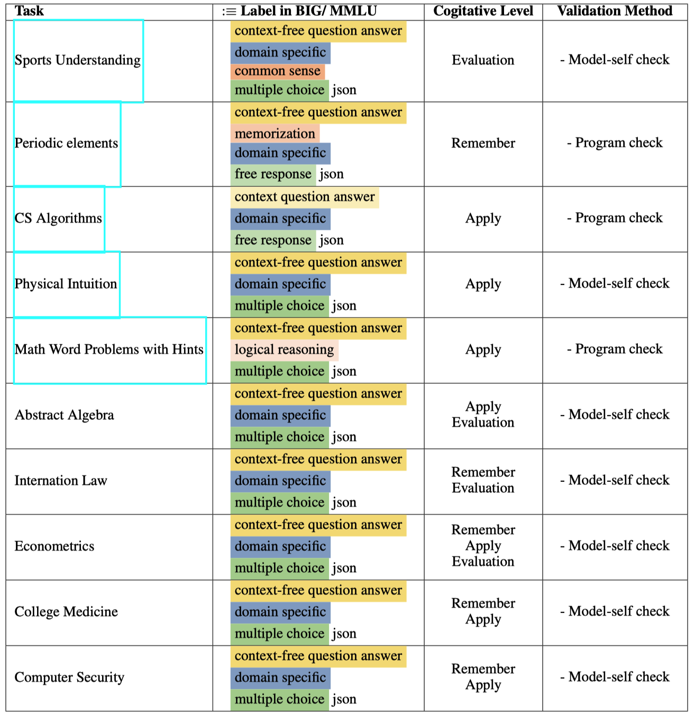

# Automating Dataset Updates Towards Reliable and Timely Evaluation of Large Language Models

This is the data for the paper [Automating Dataset Updates Towards Reliable and Timely Evaluation of Large Language Models](https://arxiv.org/abs/2402.11894). 

## Overview

Large language models (LLMs) have achieved impressive performance across various natural language benchmarks, prompting a continual need to curate more difficult datasets for larger LLMs, which is costly and time-consuming.

In this paper, we propose to automate dataset updating and provide systematical analysis regarding its effectiveness in dealing with benchmark leakage issue, difficulty control, and stability. Thus, once current benchmark has been mastered or leaked, we can update it for timely and reliable evaluation. There are two updating strategies: **1) mimicking strategy** to generate similar samples based on original data, preserving stylistic and contextual essence, and **2) extending strategy** that further expands existing samples at varying cognitive levels by adapting Bloom’s taxonomy of educational objectives. Extensive experiments on updated MMLU and BIG-Bench demonstrate the stability of the proposed strategies and find that the mimicking strategy can effectively alleviate issues of overestimation from benchmark leakage. In cases where the efficient mimicking strategy fails, our extending strategy still shows promising results. Additionally, by controlling the difficulty, we can better discern the models’ performance and enable fine-grained analysis — neither too difficult nor too easy an exam can fairly judge students’ learning status.

To the best of our knowledge, we are the first to automate updating benchmarks for reliable and timely evaluation.


## Dataset

#### Data instance - Mimicked dataset

From Algebra from MMLU we totally involved 10 tasks to conduct update using mimicking strategy.  Below shows the detailed information of the selected 10 tasks of MMLU and BIG-bench.



This table elaborates on the detailed task information, question format, and corresponding cognitive levels of the selected tasks from BIG-bench and MMLU (for MMLU we manually labeled each task). Additionally, it outlines the validation method employed for the mimicked tasks. For the "Model-self" check, we deploy the model itself to identify and filter out instances with incorrect answers. For the “Program check” we write programs to filter out instances.

For the mimicked sample,  we keep the format the same with the original samples (seed sample) from MMLU and BIG-Bench. Below is an example for the mimicked task Algebra from MMLU.  More sample and the prompt can be find at our [demo leaderboard](https://yingjiahao14.github.io/Automating-DatasetUpdates/). The mimicked data can be found at  `data/mimic`.

```json
{
  "question": "Determine the degree for the provided field extension Q(sqrt(5), sqrt(7), sqrt(35)) over Q.",
  "A": "8",
  "B": "0",
  "C": "2",
  "D": "4",
  "answer": "D"
},
```

#### Data Statistic - Mimicked dataset

The mimicked data can be found at  `data/mimic`, and original data can be found at `data/orig`.
$$
\begin{array}{ccc|ccc}
\hline \text { Task }_{\text {BIG }} & \text { \#Orig. } & \text { \#Mimic } & \text { Task }_{\text {MMLU }} & \text { \#Orig. } & \text { \#Mimic } \\
\hline \text { Sports } & 1000 & 951 & \text { Algebra } & 100 & 93 \\
\text { Element } & 536 & 548 & \text { Law } & 121 & 117 \\
 \text { Algos } & 160 & 150 & \text { Econ } & 114 & 101 \\
 \text { Phys } & 81 & 81 & \text { Medicine } & 172 & 160 \\
\text { Math } & 7688 & 1016 & \text { Security } & 100 & 100 \\
\hline
\end{array}
$$

#### Data instance - Extended dataset

For the extending strategy, we chose the dataset Sports, Algorithms (Algos), Algebra, and Physics (Phys). The extend sample and prompt can be find at our [demo leaderboard](https://yingjiahao14.github.io/Automating-DatasetUpdates/). Below is an example:

```json
{
  "popularity": 213,
  "question": "Provide a formal definition of the tensor product of two modules over a ring, including the universal property it satisfies.",
  "ref_answer": "The tensor product of two modules M and N over a ring R, denoted by M ⊗R N, is a module T along with a bilinear map φ: M × N → T such that for every bilinear map f: M × N → P, where P is any R-module, there exists a unique linear map F: T → P such that F o φ = f. This is known as the universal property of the tensor product.",
  "level": "remember"
}
```

- `questions`: The extended question.
- `ref_answer`: Reference answer for the question.
- `popularity`: The the popularity of the subject, we gather the total page views for each seed throughout year 2023 and use it as the popularity.
- `level`: The cognitive level of the question.

#### Data Statistic - Extended dataset

The mimicked data can be found at  `data/extend`.
$$
\begin{array}{lc}
\hline \text { Task }_{\text {BIG }} & \text { \#Extending } \\
\hline \text { Algebra } & 80 \\
\text { Algos } & 160 \\
\text { Phys } & 80 \\
\text { Sports } & 824 \\
\hline
\end{array}
$$

